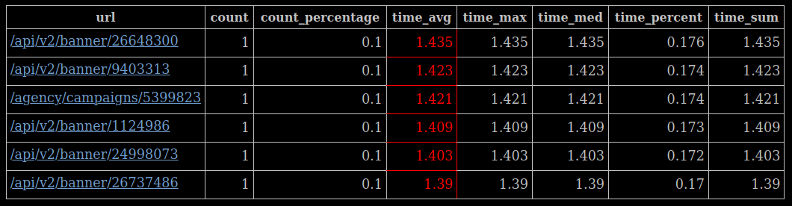
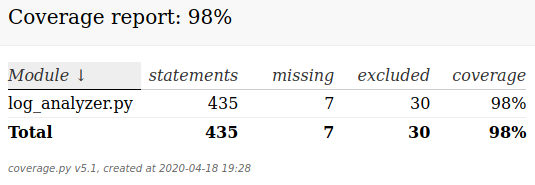

# simple log analyzer
Поддерживаемые форматы обрабатываемых файлов: **plaintext**, **gz**

Поддерживаемые форматы конфигурационного файла: **json**

Пример результата работы с подстановкой в шаблон:

#### Запуск:
Использовать конфигурационный файл: 

`python3 log_analyzer.py --config=config.json`

Создать шаблон конфигурационного файла с полным перечнем изменяемых параметров: 

`python3 log_analyzer.py --template=true --config=config.json`

#### Параметры конфигурационного файла:
    "DATE_FMT": формат даты для конвертации.
    "LOGFILE_DATE_FORMAT": формат даты для ведения лога работы скрипта
    "LOGFILE_FORMAT": формат ведения лога работы скприта
    "LOGFILE_PATH": файл для записи лога работы скрипта (если не указан запись в stdout)
    "LOG_DIR": каталог в котором лежат обрабатываемые файлы
    "LOG_LEVEL": уровень логгирования работы скрипта
    "LOG_NAME_DATE_PATTERN": паттерн даты в имени обрабатываемого файла (для поиска последнего)
    "LOG_NAME_PATTERN": паттерн имени обрабатываемых файлов (иные будут исключаться)
    "MAX_MISMATCH_COUNT": максимальное количество промахов парсера (связано с % по принципу AND)
    "MAX_MISMATCH_PERCENT": максимальный % промахов парсера
    "MIN_LOG_DATE": минимальная дата в имени файлов для обработки
    "REPORT_DIR": каталог для сохранения итоговых отчетов
    "REPORT_SIZE": максимальный размер итогового отчета
    "REPORT_TEMPLATE_PATH": шаблон для подстановки итоговых данных
    "TEMPLATE_REPLACE_TAG": тэг для замены в шаблоне
    "TS_F_PATH": файл для запись unixtimestamp (если не указан не пишется)
    "WEB_SERVER_LOG_PATTERN": паттерн для парсинга строк обрабатываемого файла

#### Запустить тесты:
`python3 -m unittest discover tests/`

#### Версии Python:
Протестировано на версии **3.6.9**, **3.8.2**

